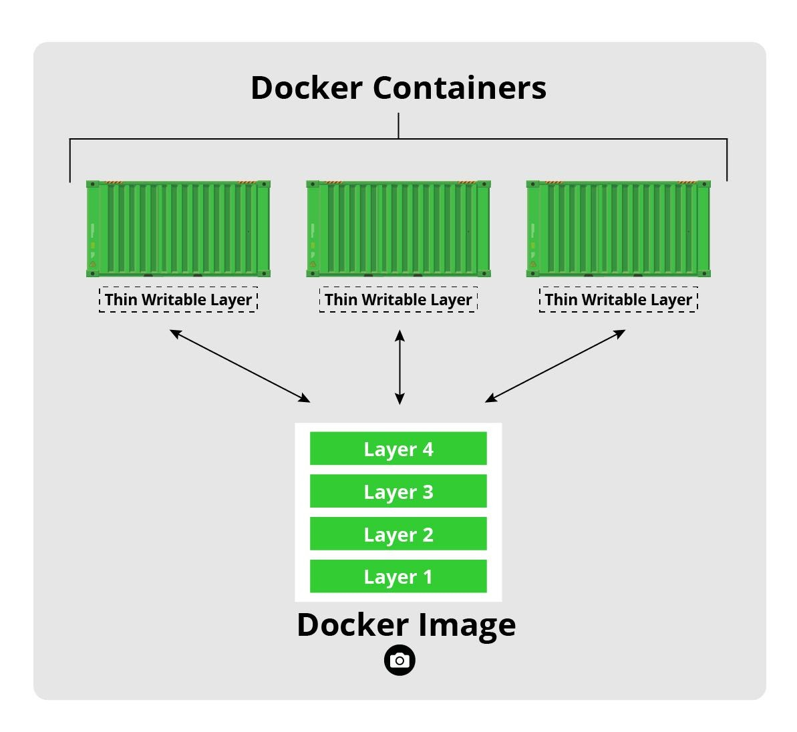

## [Docker](https://docs.docker.com/get-started/overview/)

- Docker provides the ability to package and run an application in a loosely isolated environment called a container.
- `Container` is a standalone executable package of a piece of software that includes everything to run it.
- Docker provides tooling and a platform to manage the lifecycle of your containers:

  - Develop your application and its supporting components using containers.
  - The container becomes the unit for distributing and testing your application.
  - When you’re ready, deploy your application into your production environment, as a container or an orchestrated service. This works the same whether your production environment is a local data center, a cloud provider, or a hybrid of the two.

### Uses

- Docker streamlines the `development lifecycle by allowing developers to work in standardized environments using local containers which provide your applications and services. Containers are great for `continuous integration and continuous delivery (CI/CD)` workflows.
- Docker containers can run on a developer’s local laptop, on physical or virtual machines in a data center, on cloud providers, or in a mixture of environments.
- Running more workloads on the same hardware. Cost-effective alternative to a hypervisor-based virtual machine.

### Docker architecture

> #### Docker Daemon (dockerd)
>
> It is a persistent background process that manages the docker images, containers, network, and storage volumes. Constantly listens for Docker API requests and processes them.

> #### The Docker Client
>
> The Docker client (docker) is the primary way that many Docker users interact with Docker. When you use commands such as docker run, the client sends these commands to Dockerd, which carries them out. The docker command uses the Docker API. The Docker client can communicate with more than one daemon.

> #### Docker registries
>
> A Docker registry stores Docker images. Docker Hub is a public registry that anyone can use, and Docker is configured to look for images on Docker Hub by default. You can even run your private registry.
>
> When you use the `docker pull` or `docker run` commands, the required images are pulled from your configured registry. When you use the `docker push` command, your image is pushed to your configured registry.

> ### Docker objects

> #### Images
>
> A Docker image is a read-only template that contains a set of instructions for creating a container that can run on the Docker platform. It provides a convenient way to package up applications and preconfigured server environments, which you can use for your own private use or share publicly with other Docker users.
>
> A Docker image is made up of a collection of files that bundle together all the essentials – such as installations, application code, and dependencies – required to configure a fully operational container environment. You can create a Docker image by using one of two methods:
>
> - `Interactive`: By running a container from an existing Docker image, manually changing that container environment through a series of live steps, > and saving the resulting state as a new image.
> - `Dockerfile`: By constructing a plain-text file, known as a Dockerfile, which provides the specifications for creating a Docker image.
>
> #### Image Layers
>
> Each of the files that make up a Docker image is known as a layer. These layers form a series of intermediate images, built one on top of the other in stages, where each layer is dependent on the layer immediately below it. The hierarchy of your layers is key to efficient lifecycle management of your Docker images. Thus, you should organize layers that change most often as high up the stack as possible. This is because, when you make changes to a layer in your image, Docker not only rebuilds that particular layer, but all layers built from it. Therefore, a change to a layer at the top of a stack involves the least amount of computational work to rebuild the entire image.
>
> #### Container Layer
>
> Each time Docker launches a container from an image, it adds a thin writable layer, known as the container layer, which stores all changes to the container throughout its runtime. As this layer is the only difference between a live operational container and the source Docker image itself, any number of like-for-like containers can potentially share access to the same underlying image while maintaining their own individual state.
> 
