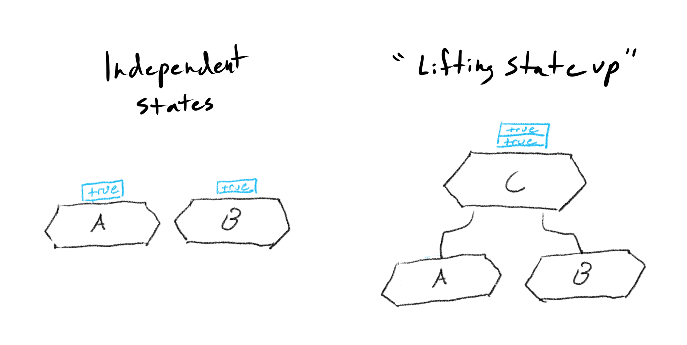

## [Context](https://beta.reactjs.org/learn/passing-data-deeply-with-context#)

**Context** lets the parent component make some information available to any component in the tree below it—no matter how deep—without passing it explicitly through props.

### Vocabulary

> **Lifting state up** - **_When you want two component to always change together, you move their state to the closest common parent and pass it down via props._**
>
> 

> **Prop Drilling** - **_The process by which you pass data from one part of the React Component tree to another by going through other parts that do not need the data but only help in passing it around._**

### Context: an alternative to passing props

- Create a context.

> ```js
> export const LevelContext = createContext(1);
> ```

- Use that context from the component that needs the data.

> ```js
> const level = useContext(LevelContext);
> ```

- Provide that context from the component that specifies the data.

> ```jsx
> <LevelContext.Provider value={level}>{children}</LevelContext.Provider>
> ```
